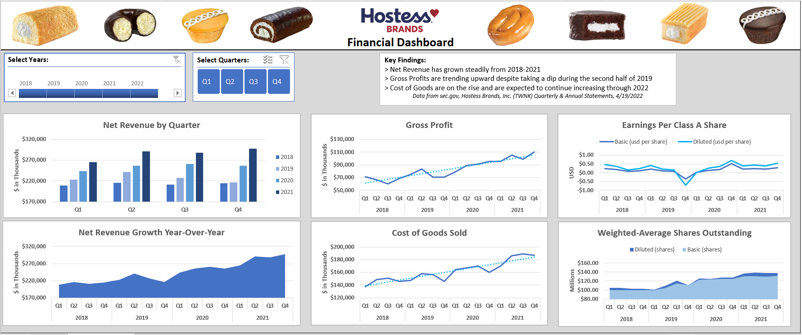

# Hostess Brands Financial Dashboard
An Excel report built on Hostess Brands, Inc. financial data from sec.gov  
Created 4/23/22  

#### Financial Dashboard:  
  

## Overview:
This report was created as a final project for a master's course at NWMSU, Financial Modeling for IT. The assignment: use concepts from the class to analyze a financial dataset.   
  
The company I chose was Hostess Brands, Inc. (TWNK), for which I downloaded a few years of quarterly and annual statements from sec.gov. I created a simple dashboard in Excel to to track the annual and quarterly results over time. 

To create visuals, I used pivot tables, pivot charts, and slicers. To transform the data into a usable format, I used formulas (ie: vlookup, sumifs, textjoin) and Power Query.

Excel Concepts Demonstrated: 
 - Formulas: if, or, sum, iferror, vlookup, indirect
 - Tables and calculated columns
 - Get & Transform (Power Query)
 - Pivot tables and pivot charts
 - Timeline and slicers

#### Dashboard:
After some initial exploratory data analysis, I identified several key metrics that may interest someone who invests in TWNK stock, then set out to answer these questions through the following visuals presented in the dashboard. 

- Charts:  
    - Net Revenue by Quarter
    - Net Revenue Growth YoY
    - Gross Profit
    - Cost of Goods Sold
    - Earnings per Class A Share
    - Weighted-Average Shares Outstanding 

## Development Approach:
The following steps were taken to create the report:
    
1. Quarterly and annual financial statements (2018 through 2021) were downloaded from sec.gov.
2. The data files were compiled in Excel.
3. Using lookup formulas, the data files were consolidated into one sheet, in a wide format.
4. Using Get & Transform (Power Query), the consolidated data was unpivoted into long format.
5. Pivot tables and pivot charts were built for each metric.
6. The charts were incorporated into a dashboard, and were formatted into a cohesive theme.
7. An analysis of key findings was added to the dashboard.
   
      
#    
Logo and images are credited to Hostess Brands, Inc.  
https://www.hostessbrands.com/  

